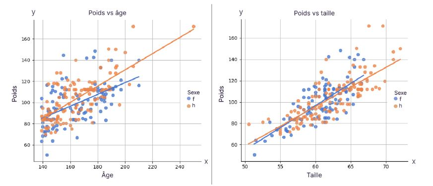
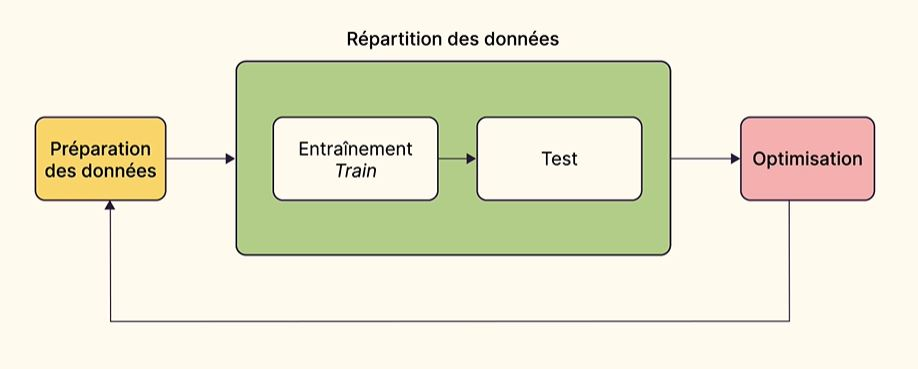

# 📓 Notes : Initiez-vous au machine learning

> **Cours :** https://openclassrooms.com/fr/courses/8063076-initiez-vous-au-machine-learning

> **Début du cours :** 21/05/2026

> **Fin du cours :** xx/06/2026

---

## 🧭 Partie 1 - Découvrez les grands principes du Machine Learning

### 1.1 Qu'est-ce que le Machine Learning ?
* Le Machine Learning est la brique de base de l'IA, la chaîne dans le vélo, le moteur dans la voiture, le rouage de l'automate.

* Le Machine Learning a une tâche précise à accomplir : **prédire**.

* Le Machine Learning utilise des **algorithmes** pour développer des modèles prédictifs à partir de **jeux de données** (**datasets**, en anglais).

### 1.2 Abordez le domaine d'application du Machine Learning

#### 1.2.1 Différenciez modélisation statistique et modélisation prédictive

* **La modélisation statistique :** 
	* La première question (**“Quel est le profil des utilisateurs qui s’abonnent ?”**) est relative au profil. Avec cette question, on cherche à comprendre l'acte d'abonnement en fonction des caractéristiques des utilisateurs.
	* On est dans une démarche d'analyse et d'interprétation de la dynamique entre les variables. La modélisation statistique s'appuie sur des tests d'hypothèses et des modèles mathématiques pour évaluer les conclusions de l'analyse.

* **La modélisation prédictive :**
	* La seconde question (**“Comment prédire si un nouvel utilisateur va s’abonner ?”**) est relative à la prédiction. Avec cette question, on ne cherche qu'à prédire l'acte d'abonnement le plus efficacement possible. C'est l'approche Machine Learning.
	* On attend 2 choses du modèle prédictif issu d'une approche Machine Learning :
		1. Des prédictions de qualité, soit un bon score que l'on va calculer grâce à une métrique choisie au préalable.
		2. Sa capacité à extrapoler : soit à généraliser ses prédictions à partir des données d'entraînement. On parle de robustesse du modèle face à de nouveaux échantillons.
		> Dans ce contexte, la performance des prédictions est centrale et on ne cherche pas à expliquer la logique conduisant à une prédiction donnée. On assimile en quelque sorte le modèle à une boîte noire / black box, son fonctionnement interne étant jugé trop complexe pour être interprétable par un humain.

* Prenons un exemple : la présélection d'un CV de candidature est souvent automatisée. Dans une approche ML pure, le recruteur ne connaît pas les critères de sélection du modèle, seulement la sélection de candidats. Le candidat ne pourra pas non plus s'assurer qu'il n'y a pas eu discrimination par le modèle.

* La question de l'interprétabilité des prédictions d'un modèle de type boîte noire est cruciale dans certains secteurs (banque, assurances, ressources humaines…). Heureusement, des solutions existent pour déterminer quelles sont les variables qui ont le plus influencé une prédiction donnée.

* En l'occurrence, les librairies **Shap** et **Lime** permettent d'expliquer la prédiction de la plupart des modèles de Machine Learning.

* Pour résumer, voici les différences entre modélisation statistique et modélisation prédictive :

	| | Modélisation statistique | Modélisation prédictive (= Machine Learning) |
	| :--- | :--- | :--- |
	| **Objectif** | Expliquer, analyser | Prédire |
	| **Focus** | Fiabilité des conclusions : tests d'hypothèses et intervalles de confiance | Performance, résilience et robustesse du modèle |
	| **Utilisation des données** | Tous les échantillons | Une partie des échantillons est réservée à l'évaluation des performances du modèle |
	| **Librairies Python** | statsmodel | scikit-learn, PyTorch, TensorFlow |

> À noter que les librairies Python mentionnées dans ce tableau sont les plus courantes. Il en existe bien d'autres adaptées à différent types de contextes (XGBoost, Keras…).

* Bien que l'on puisse aussi utiliser les modèles statistiques pour de la prédiction, la puissance des modèles Machine Learning est sans commune mesure. D’ailleurs le cours se concentre là-dessus.

* La fonction prédictive du Machine Learning est polymorphe. Autrement dit, selon les besoins elle s'appelle “classification”, “supervision”, “détection”, “proposition”, “ranking”, “prévision”... mais à la base il y a toujours un but de prédiction.

* Nous profitons de cette profusion de modèles prédictifs au quotidien :
	* proposition de contenu sur les plateformes ;
	* prévention et surveillance globale ;
	* évaluation des risques ;
	* IA générative ;
	* optimisation des chaînes de production et de ventes ;
	* détection des anomalies ;
	* prévisions temporelles, etc.

> Dans ce cours nous allons travailler sur le Machine Learning dit classique. Le ML classique se nourrit de jeux de données tabulaires, c’est-à-dire que l'on peut exprimer sous forme de tableau, et qui sont de taille raisonnable (moins d’1 gigabit). Un tel jeu de données peut prendre la forme d'un simple fichier CSV, Excel ou JSON, ou être directement extrait d'une base de données (SQL, NoSQL).

> On laisse les données plus lourdes (de type audio, images, vidéo) et l'IA générative au deep learning et aux réseaux de neurones.

* À la base du Machine Learning se trouve le jeu de données (ou dataset, en anglais). L'apprentissage se nourrit de données. Sans données, pas de Machine Learning !

#### 1.2.2 Comprenez en quoi consiste le Machine Learning

* Le but du ML est donc d'entraîner un modèle prédictif à partir d'un jeu de données.

* Quand on parle de jeux de données, pensez à une feuille de type Google Spreadsheet ou tableur Excel. Les variables sont les colonnes, et les échantillons sont les lignes.

> On distingue la variable cible, sujet de la prédiction, des autres variables potentiellement prédictrices.

* Par exemple, prenons un jeu de données comprenant l'âge, la taille et le poids d'une centaine de collégiens. Si on souhaite prédire le poids des enfants en fonction de leur taille et de leur âge, la variable cible sera le poids et les variables prédictrices seront l'âge et la taille.

> On part d'un jeu de données à priori “exploitable”. Concept fourre-tout qui suppose que les variables aient une relation entre elles. Le dataset n'est pas un regroupement totalement aléatoire de données qui auraient été collectées on ne sait comment.

* Reprenons l’exemple de notre jeu de données comprenant l'âge, la taille et le poids d'une centaine de collégiens. On suppose raisonnablement que la taille et l'âge d'un enfant sont liés à son poids.

* Voici donc notre formule :

	***poids=fonction(age,taille)+bruit***
	
	> Le "bruit" représente l'information qui n'est pas capturée par le modèle.
	
	

Voici les étapes pour développer un modèle prédictif à partir de ce dataset :

1. **DataCleaning: le travail sur la donnée**

	* Tout commence par un travail de transformation des données brutes pour les rendre compatibles avec le modèle de ML choisi : nettoyage, normalisation, numérisation, etc. On parle de nettoyage des données ou data cleaning.

	>Exemples : données manquantes (la moitié des tailles manquent), données erronées (une personne a 200 ans ou un poid est négatif), ou normalisation nécessaire (prix de vente de maison en centaines de milliers vs nombre de mètres carrés en centaines), format et accessibilité des données : 200 fichiers Excel à combiner, fichiers trop lourds, pas compatibles, etc.

2. **Validation croisée**

	* Comme on veut obtenir un modèle qui soit capable de bien performer sur des données qu'il n'a pas déjà rencontrées lors de son entraînement, on veut éviter que le modèle ne soit évalué sur les échantillons d'entraînement.
	* On va donc découper le dataset en 2 parties :
	* Une partie des échantillons sont réservés à l'entraînement du modèle. Par convention, on appelle cette partie train, pour “entraînement”.
	* L'autre partie est mise de côté pour évaluer la performance du modèle sur des données qu'il n'a pas vues. Par convention, on appelle cette partie test.
	* On considère habituellement un ratio entre train et test de 80 / 20 %.
	* On va d'ailleurs répéter ce découpage plusieurs fois et de façon aléatoire pour s'assurer que le modèle performe dans tous les cas de répartition train / test. Cette méthode s'appelle la validation croisée (nous reviendrons dessus de façon plus approfondie).

	

>Au fil des expériences, on risque d'optimiser manuellement le modèle vis-à-vis du dataset de test. Donc pour éviter cela, on va scinder le dataset en non pas 2 mais 3 parties pour être bien sûr qu’une partie des données ne soit jamais visible par le modèle. On a donc au préalable à la validation croisée réservé une partie dite de validation sur laquelle on ne regardera les performances du modèle qu'une fois celui-ci totalement entraîné et optimisé. Cependant, dans certains domaines d'application, comme par exemple la prédiction des stocks, on veut être absolument sûr que cette séparation soit absolue, et donc on n’a qu'un shot pour utiliser le dataset de validation. Une fois cette cartouche utilisée, on ne veut plus toucher au modèle de peur de le corrompre. Mais c'est toutefois un cas extrême de séparation de l'évaluation et de l'entraînement d'un modèle.

3. **Optimisation du modèle**

	* En parallèle, on va chercher à améliorer la performance du modèle en modifiant ses paramètres et en observant son score sur chaque version train / test du dataset. Chaque type de modèle a sa propre famille de paramètres qui dépend des librairies utilisées. C'est à force de travailler sur ces paramètres que l'on développe un véritable savoir-faire de data scientist.

#### 1.2.3 Distinguez approche non supervisée et approche supervisée
Imaginez que vous ayez beaucoup de photos de chats et de chiens. Vous souhaitez les classer automatiquement en utilisant un modèle de Machine Learning.

* **L’approche non supervisée**
	
	* Dans l'approche **non supervisée**, vous n'avez pas de système d’étiquetage pour différencier les photos de chats et de chiens. Cela dit, le modèle va essayer de regrouper automatiquement les photos en fonction de leurs caractéristiques intrinsèques. Il les regroupe en grappes (ou clusters, en anglais), sans aucune connaissance préalable sur les espèces. On parle donc de **clustering**.

* **L’approche supervisée**
	
	* En revanche, dans l'approche **supervisée**, il vous faudra étiqueter chaque image en “chat” ou en “chien”. Cette étiquette constitue alors la variable cible que le modèle va chercher à prédire. Cet étiquetage est réalisé par un humain et peut entraîner un coût important quand il s'agit d'étiqueter des milliers d'échantillons, voire plus.

	* Dans l'approche supervisée, en fonction de la nature de la variable cible, on parlera :
		* de **classification** lorsque l'on prédit des catégories : 
			* binaires (oui/non),
			* ordinales (petit, moyen, grand),
			* ou nominales (chat - chien - brebis , bleu - rose - vert - blanc...) ;
		* et de **régression** lorsque l'on prédit une variable continue : prix, âge, salaire, volume, température, etc.

	

> Le Machine Learning supervisé nécessite des données étiquetées pour entraîner le modèle à prédire des valeurs spécifiques d'une variable donnée, tandis que le Machine Learning non supervisé cherche à trouver des structures ou des groupements inhérents aux données.

#### En résumé
* Le Perceptron, ancêtre des réseaux de neurones actuels, a été inventé en 1957 : le Machine Learning ne date pas d'hier.

* La modélisation statistique tend à comprendre la dynamique interne des variables tandis que le Machine Learning a pour unique but la prédiction d'une de ces variables.

* Il y a 3 étapes pour développer un modèle : travail sur la donnée, validation croisée et optimisation.

* On distingue deux approches : l’approche supervisée, où une des variables est utilisée comme cible de la prédiction ; l'approche non supervisée qui vise à regrouper les échantillons par similarité (on parle de clustering).

* Dans l'approche supervisée, dans le cas d'une variable cible continue on parlera de régression, et de classification si la variable cible est composées de catégories.

* Vous trouverez de nombreux datasets pour le Machine Learning sur le site de UCI.

#### Exercice 1.2
* Tout modèle prédictif repose sur un jeu de données. Sans données, pas de **Machine Learning**.

* En 1978, David Aha, étudiant à l’université de Californie à Irvine, a créé un serveur mettant à disposition des jeux de données pour le **Machine Learning**. Ce serveur est maintenant une source incontournable de données avec plus de 600 jeux de données, répertoriés par tâche et par type de donnée… et vous allez l'explorer.

> Rendez-vous aux **[archives de jeux de données](https://archive.ics.uci.edu/datasets)** de l’université. Le jeu de données en tête de page est **[Iris](https://archive.ics.uci.edu/dataset/53/iris)** (*dataset* en anglais).

Vous observez :

| La tâche | Classification |
| :--- | :--- |
| **Le nombre d’échantillons** | 150 |
| **Le nombre de variables** | predictive: attributes: 4 |
| **La date de donation** | 1 juillet 1988 |

Cliquez sur le nom du dataset Iris pour accéder à sa [page](https://archive.ics.uci.edu/dataset/53/iris) et observez entre autres :
- les informations sur les variables : attributes, information et Features ;
- les performances attendues en fonction des modèles considérés ;
- le dataset est accessible via le bouton Download.

Explorez le site en utilisant les filtres de recherche.

Par exemple :
- data type: tabular
- task: classification

> Au fil de votre exploration des datasets des archives UCI, vous pouvez remarquer que l'on retrouve souvent les mêmes éléments. Comparez par exemple le dataset Iris avec le dataset **[Heart Disease](https://archive.ics.uci.edu/dataset/45/heart+disease)**.

Vous remarquerez que chaque page a :
- une présentation du dataset ;
- les articles académiques utilisant le dataset ;
- les informations sur les variables ;
- et la performance relative des principaux modèles prédictifs.

>En règle générale, un dataset dédié au Machine Learning :
>1. Comporte une description précise de la nature des variables.
>2. Indique le type de problème adapté et l'utilisation qui en est faite.

Il existe bien d'autres sources de datasets, nous y reviendrons.

### 1.3 Découvrez les notions de modèle et d'algorithme

### 1.4 Passez d'une problématique business à la mise en production

---

## 📈 Partie 2 - Manipulez les fonctions de base d'un modèle prédictif

### 2.1 Évaluez la performance d'un modèle prédictif

### 2.2 Découvrez le principe de la régression linéaire

### 2.3 Classifiez les données avec la régression logistique

### 2.4 Partitionnez les données avec k-means

---

## 🛠️ Partie 3 - Transformez vos jeux de données

### 3.1 Comprenez le rôle central du jeu de données

### 3.2 Améliorez un jeu de données

### 3.3 Transformez les variables pour faciliter l'apprentissage du modèle

---

## 🚀 Partie 4 - Optimisez les performances d'un modèle

### 4.1 Améliorez le modèle

### 4.2 Augmentez la robustesse de vos modèles

### 4.3 Découvrez l'apprentissage d'ensemble avec les forêts aléatoires

---

## 💡 Mes Réflexions "Data Architect"
- 
- 

## ❓ Points à approfondir / Questions
- [ ] 
- [ ] 
- [ ] 